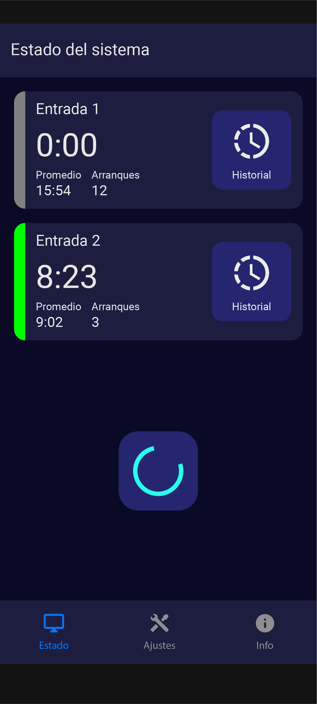
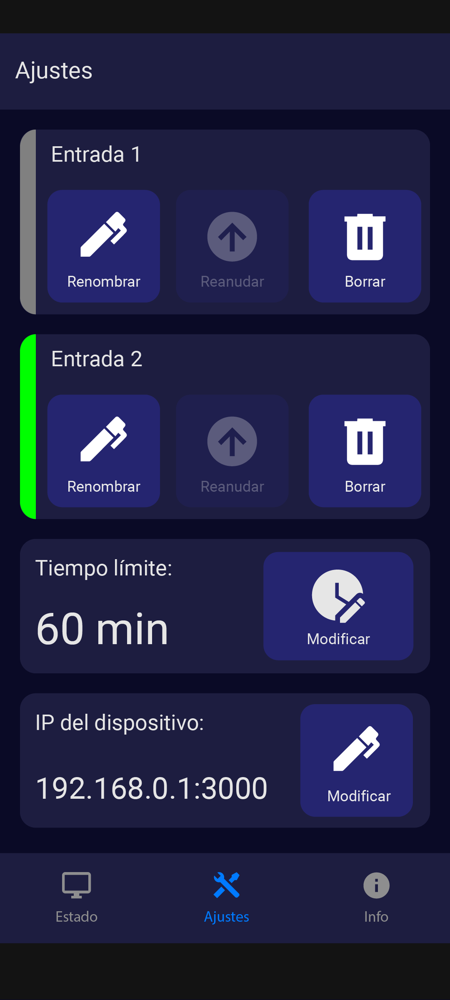
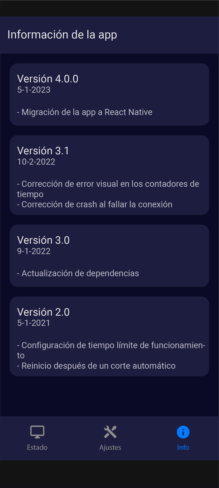
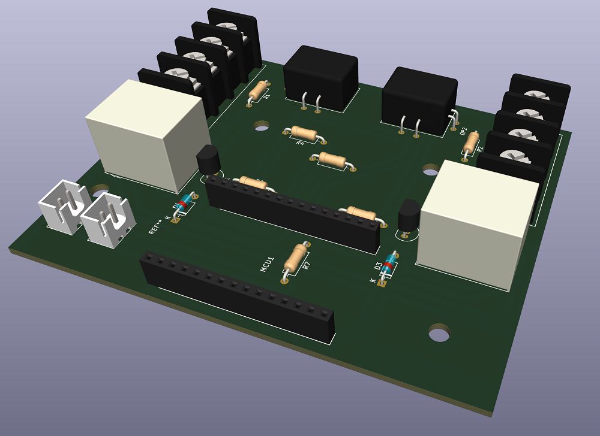
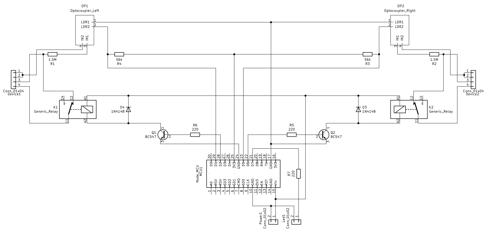

# bombitapp

### What is this
This project is a **device that controls and protects electric water pump systems**, built with an **ESP8266** based board, and operated from a mobile app developed in [React Native](https://reactnative.dev/). The device is able to preventively cut off power from the pump engines when an abnormal functioning is detected.

It's designed to operate over this preexisting pump setup:
- 2 220VAC 1/2 HP pumps.
- 2 water tanks.
- 2 water level sensors, placed inside the tanks and made by an on/off switch that turns on when the tank gets emptied and turns off when the filling process is complete. That switch operates directly at 220VAC and it's signal is plugged in to the pumps.
- 2 separated pipe circuits, each one connected to a different tank and pump. 

For different mechanical reasons, the sensors sometimes fail and keep the pumps engines running indefinitely, until manually fixed. If this happens, both the engines and the tanks could result **physically damaged** if the problem isn't solved quickly. This device's idea is to **cut pump power** if the sensor is sending the signal over a time period that exceeds some predefined threshold, to protect the setup. From a mobile app, the user can **resume the power after fixing the problem**, or **read the tank filling time history** to get an idea of the expected values. 

### Components
The project has the following components and features:

##### Hardware
- An ESP8266 based board, able to connect to the home Wi-Fi network.
- A custom PCB, to allow the ESP mounting and connection to the inputs and ouputs.
- 2 220VAC inputs, to recieve the tank water level signal. The ESP will read that signal to make it's decissions.
- 2 220VAC outputs, to power the water pumps. The ESP will power them with the water level sensor signal or not, depending on it's decissions.
- 1 5VCC input, to power the ESP board.
- 1 LED to indicate the WiFi connection status.

##### Firmware
- A sketch written in C++ and loaded to the ESP.
- Allows the level sensor signal to reach the output and power the pump until a time threshold is exceeded. After that, the connection is stopped to prevent the engine to keep working. If the signal stops before the threshold (i. e. the filling was successful), nothing happens.
- The time threshold can be setted via an HTTP request.
- Allows to resume the pump power via an HTTP request, overriding the stop state.
- The current engine working time can be get with an HTTP request.
- Allows to see the latest 10 engine run times via an HTTP request.
- Allows to see an average of all the previous engine run times via an HTTP request.
- The water level sensor status can be seen via an HTTP request (i. e. if it's on or off).

##### Mobile App
- A React Native mobile app compiled for Android.
- Gives a nice and human-friendly presentation layer for the firmware interaction, showing engine status and actions that can be made through HTTP.

### Examples
##### Mobile App
    

##### PCB 3D model
 

##### Circuit schematic
 

