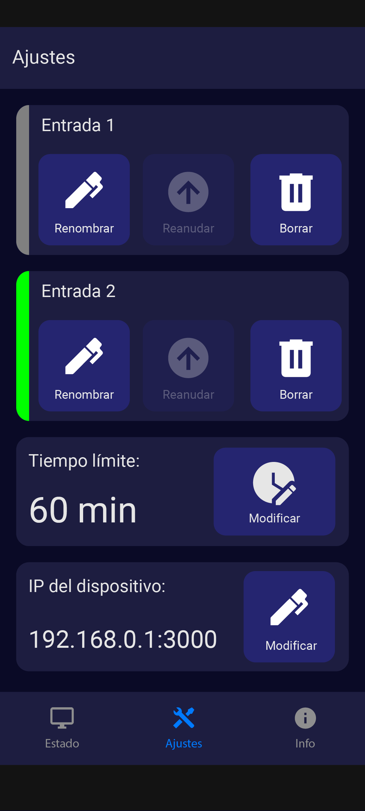

# App
This **React Native** app allows the end-user to see the system status, and set the system configurations.

With it, the user can:
- See the current devices statuses
- See the run time history
- See the average run time
- Set the time threshold to stop a device
- Clear run time history
- Set the system IP, to send the requests to

### Development notes:
There is a mock created with [JSON Server](https://github.com/typicode/json-server/tree/v0) that allows the developer to have working endpoints to test the app against, without having to run the firmware in a board. The mock IP can be configured in the `mock` script inside the `package.json` file.

To launch the app in a device or an emulator, use:  
`npm run android`

To compile an APK, use:  
`npm run assemble`

To start the mock server, use:
`npm run mock`

### Examples:
Some examples of the app screens.

    
